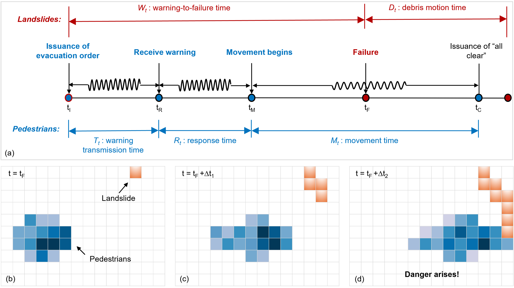

# Cha Kwo Ling Landslide Evacuation Simulation

This repository contains the spatial input data and pedestrian evacuation
simulation code for the Cha Kwo Ling landslide evacuation case in Hong Kong.
The model uses a customized version of
[PySocialForce](https://github.com/yuxiang-gao/PySocialForce) and represents
uncertainty in warning-transmission time, response time, and desired walking
speed using Monte Carlo sampling and representative scenarios.

## Repository structure

```text
Evacuation/
|-- assets/              # Figures used in this README
|-- code/
|   |-- code.py          # Main simulation script
|   `-- code.toml        # Social-force configuration
|-- data/                # Spatial input data and data documentation
|-- pysocialforce/       # Customized social-force implementation
|-- .gitignore
|-- environment.yml
|-- LICENSE
|-- README.md
`-- requirements.txt
```

The simulation creates `results/` and `animation/` at runtime when output is
generated. These directories are intentionally excluded from Git.

## Model overview

The simulation represents 198 residents distributed among 35 households.
Warning-transmission times and response delays are sampled at the household
level. Three representative pre-movement scenarios are simulated: a central
scenario (`mean`), a relatively fast scenario (`q10`), and a relatively slow
scenario (`q90`). In the current implementation, the fast and slow scenarios
are selected against the 90th- and 10th-percentile cumulative completion
curves, respectively.

Desired walking speeds are sampled separately for the slower population group
and other adults. For each group, the complete Monte Carlo realization closest
to the converged mean ordered-speed curve is used as the representative speed
configuration.



**Fig. 3.** (a) Timeline of the evacuation process, and (b)-(d) dynamic
spatiotemporal interactions between pedestrians and landslides during
evacuation.

## Environment setup

The model has been tested in the `SFMG` Conda environment with Python 3.8.12.
The tested package versions are recorded in both `environment.yml` and
`requirements.txt`.

### Create the tested Conda environment

From the repository root, create and activate the environment:

```bash
conda env create -f environment.yml
conda activate SFMG
```

If an environment named `SFMG` already exists, update it from the file instead:

```bash
conda env update --name SFMG --file environment.yml --prune
conda activate SFMG
```

Confirm that the intended interpreter is active:

```bash
python --version
```

The expected version is Python 3.8.12.

### Alternative pip installation

Users who do not use Conda can create a virtual environment and install the
pinned dependencies with pip:

```bash
python -m venv .venv
```

On Windows PowerShell, activate it with:

```powershell
.\.venv\Scripts\Activate.ps1
```

Then install the dependencies:

```bash
python -m pip install -r requirements.txt
```

GeoPandas and Rasterio depend on native geospatial libraries. A Conda
environment is therefore recommended if installation through pip is
unsuccessful.

## Running the simulation

After activating `SFMG`, run the following command from the repository root:

```bash
conda activate SFMG
python code/code.py
```

The script resolves the configuration and data paths relative to the
repository root. The social-force configuration is read from
`code/code.toml`. Generated simulation states, serialized simulator objects,
and diagnostic files are written to `results/`. Optional animations are
written to `animation/`.

## Input data

The `data/` directory contains household departure locations, evacuation
guide paths, shelter and road rasters, building outlines, and
landslide-related map layers. See [data/README.md](data/README.md) for the
required directory layout and Shapefile component requirements.

## Generated outputs

Generated outputs are excluded from version control because complete runs may
produce large binary files. They can be reproduced by installing the required
dependencies and running `python code/code.py`.

## Citation

If you use this repository, please cite the associated paper after its final
bibliographic details become available.

## License

The software is distributed under the HKUST License.
